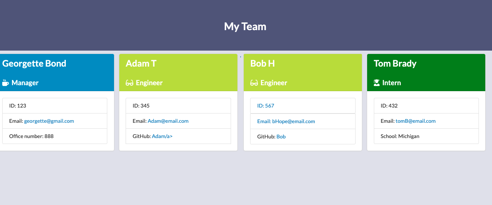

# Employee Directory 

Is a interface using Node CLI, Node Inquirer, Jest (testing)

 

This interface is to allow for the application to populate employee data.  This assignment is to also test the data with Jest.  

Above is the directory within the html

Begin by running npm run test
Next to input your data you will want to run node app.js, this will allow you to input your info into the site.  
After you will click on the teams.html file and open in browser
 

 To see the full demo please visit : https://drive.google.com/file/d/11RkbnjL8oZUxJonUJN5Sk7zwJ-F5miQJ/view

 If you would like to reach out to me please send me a message through my email or github 